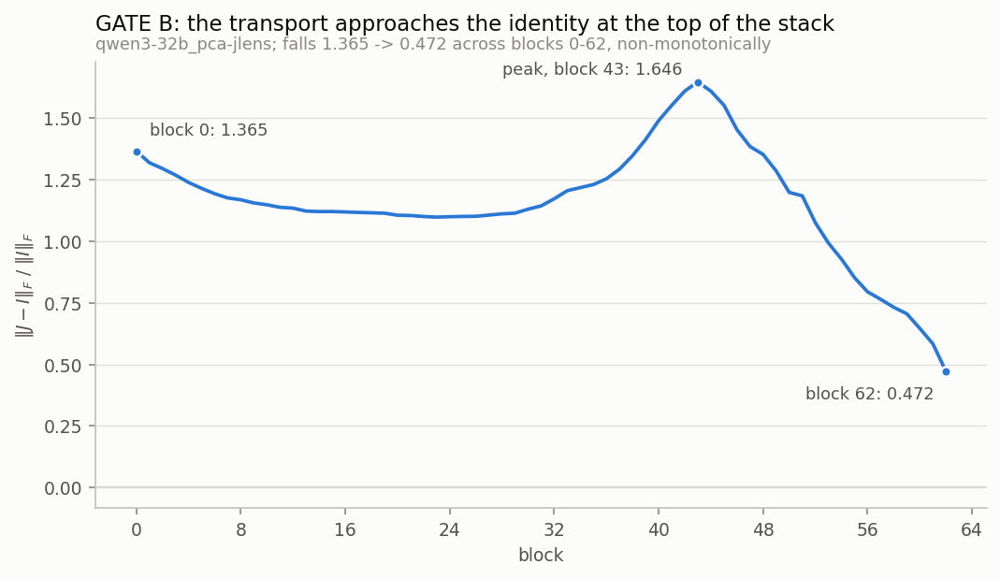
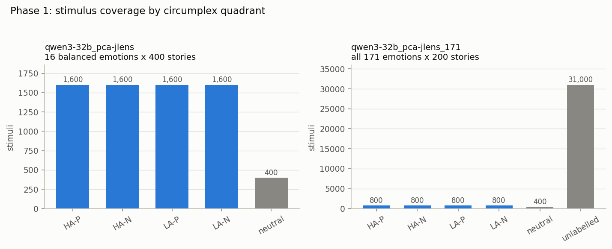
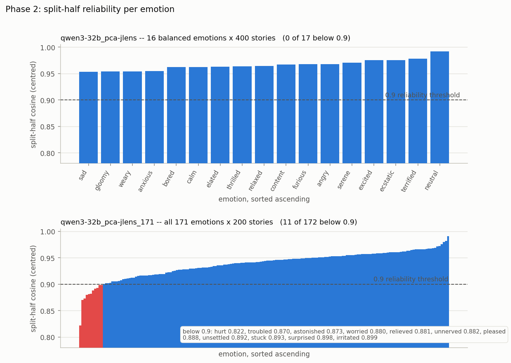
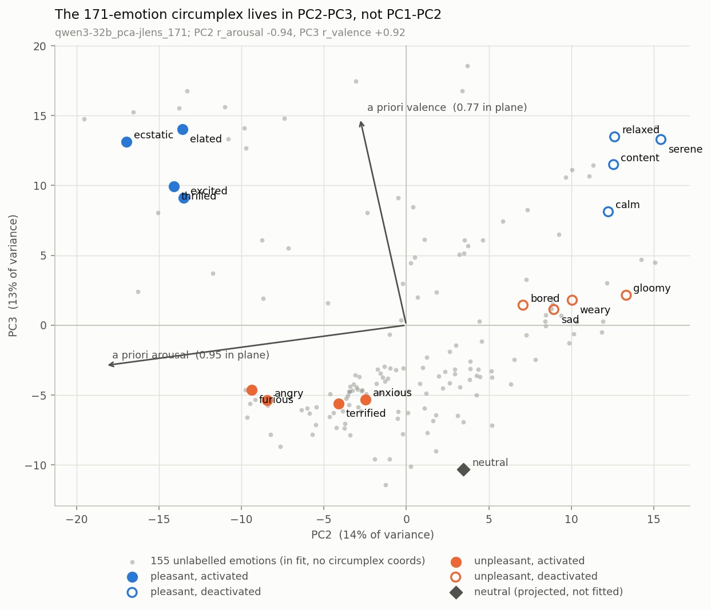
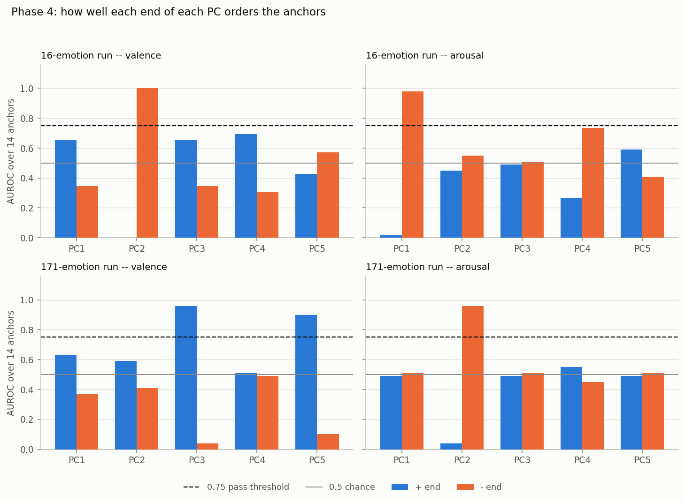
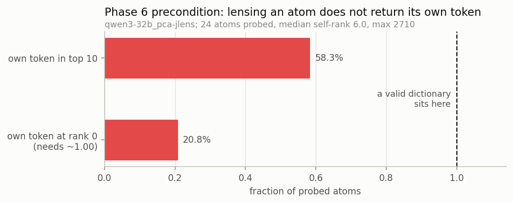

<!-- Generated by analysis/results_notebook.ipynb. Do not edit by hand. -->
<!-- Every number is read from outputs/*/results/phases/; nothing was re-run. -->
---

# Emotion PCA x Jacobian lens -- assembled results

All numbers below are read from artefacts under `outputs/*/results/phases/`. Nothing was re-run to produce this document.

| key | run | design |
| --- | --- | --- |
| `16` | `qwen3-32b_pca-jlens` | 16 balanced circumplex emotions, 400 stories each (+400 neutral) |
| `171` | `qwen3-32b_pca-jlens_171` | all 171 emotions, 200 stories each (+400 neutral); the same 16 are the labelled anchors |

## 0. Provenance

**Provenance, both runs**

| field | 16 | 171 |
| --- | --- | --- |
| design | 16 balanced emotions x 400 stories | all 171 emotions x 200 stories |
| model | Qwen/Qwen3-32B | Qwen/Qwen3-32B |
| model_sha | 9216db5781bf21249d130ec9da846c4624c16137 | 9216db5781bf21249d130ec9da846c4624c16137 |
| dtype / activation dtype | bfloat16 / bfloat16 | bfloat16 / bfloat16 |
| lens repo | neuronpedia/jacobian-lens | neuronpedia/jacobian-lens |
| lens subfolder | qwen3-32b | qwen3-32b |
| lens file | Qwen3-32B_jacobian_lens.pt | Qwen3-32B_jacobian_lens.pt |
| checkpoint format | fit_checkpoint | fit_checkpoint (from run 16) |
| d_model | 5120 | 5120 |
| lens prompts (checkpoint n_done) | 80 | 80 |
| lens prompts (config.yaml claim) | 615 | 615 |
| fitted blocks | 0..62 (63 blocks) | 0..62 (63 blocks) |
| target block (block convention) | 31 | 31 |
| target block (hidden_state index) | 32 | 32 |
| target resolved from | None -> middle of the fitted block range | None -> middle of the fitted block range |
| pooling | mean_after_offset (offset 50, max_len 512) | mean_after_offset (offset 50, max_len 512) |
| R2 prefix | pca-jlens-activations/qwen3-32b_pca-jlens | pca-jlens-activations/qwen3-32b_pca-jlens_171 |
| dataset | ryancodrai/emotion-probes | ryancodrai/emotion-probes |
| dataset sha | 720f2eb3173a77ca70ebef8ed091fc1844f70340 | 720f2eb3173a77ca70ebef8ed091fc1844f70340 |
| stimuli rows | 6800 | 34600 |
| stimuli sha256 | 37509c75ec59b8bc... | 94cf26bcf0112843... |
| emotion vectors (incl. neutral) | 17 | 172 |
| gate files present | phase0, phase1, phase2, phase3, phase4, phase6 | phase1, phase2, phase3, phase4 |

### FLAG -- the published lens is an interrupted fit

The `qwen3-32b` Jacobian lens on the Hub is a **resumable `fit_checkpoint`**, not a finished lens: it stores `jacobian_sum` (a running sum over prompts) plus `n_done`, and the mean is `jacobian_sum / n_done`. Reading that divisor is what caught the problem.

* checkpoint `n_done` = **80** prompts
* the accompanying `config.yaml` records `prompts_fitted` = **615**
* the fit's own stopping rule was `stop_at_delta = 0.002` over a 10-prompt window, with `min_prompts = 100` -- so 80 prompts is short of the fit script's own floor

**Divisor cross-check: DISAGREE.** The normalisation constant is therefore not confirmed. This matters asymmetrically:

* **Top-k readouts are unaffected.** The model's final norm is an RMSNorm, so a globally mis-scaled `J` yields *identical* top-k tokens. Phase 0 verified scale-invariance numerically (`scale_invariant_top5: true`).
* **Every magnitude-sensitive quantity is suspect**: GATE B's `||J - I||_F / ||I||_F` curve, and any Phase 6 variance split.

Both runs use the same lens file, so this applies to both. `run.py refit_lens` produces a converged alternative; it has not been run.

**Verbatim warning recorded by the pipeline itself:**

> this lens was fitted on 80 prompts -- the published qwen3-32b artefact, whose fit was interrupted well short of its own convergence threshold. A weak PC readout on it cannot be distinguished from lens noise. GATE A is what decides whether the readouts below mean anything; `run.py refit_lens` produces a converged alternative.

## 1. Phase 0 -- lens gates

**GATE A -- factual items (16-emotion run; the 171 run did not re-gate)**

| item | expected word | best rank | block | verdict |
| --- | --- | --- | --- | --- |
| basketball-players | basketball | 27 | 55 | near |
| sport-equip-tennis | tennis | 1 | 41 | HIT |
| multihop-currency | Italy | 5 | 41 | HIT |
| multihop-currency | Italian | 9 | 62 | HIT |
| animal-nose-elephant | elephant | 3 | 34 | HIT |
| amazon-language | Brazil | 16 | 62 | near |

**GATE A -- emotion vignettes (16-emotion run)**

| item | expected word | best rank | block | verdict |
| --- | --- | --- | --- | --- |
| grief | grief | 200 | 62 | MISS |
| anger | anger | 4230 | 41 | MISS |
| anger | angry | 1302 | 34 | MISS |
| relief | relief | 115 | 62 | MISS |
| lonely | lonely | 84 | 55 | near |
| lonely | loneliness | 129 | 55 | MISS |
| shame | shame | 707 | 28 | MISS |
| frustrated | frustrated | 222 | 55 | MISS |
| frustrated | frustration | 76 | 55 | near |
| chess | chess | 0 | 55 | HIT |

**GATE A -- split tally**

| group | n | HIT | near | MISS | median best rank |
| --- | --- | --- | --- | --- | --- |
| factual | 6.000 | 4.000 | 2.000 | 0.000 | 7.000 |
| emotion vignettes | 10.000 | 1.000 | 2.000 | 7.000 | 164.500 |

**Reading.** 5/16 items hit overall, but the split is the result: **4/6** factual items hit (median best rank 7) against **1/10** emotion vignettes (median best rank 164). The single emotion-group HIT is `chess`, which is the control item in that block, not an emotion word. The lens reads factual content and does not surface English emotion nouns. Section 5 measures why.

*Figure -- GATE B: ||J - I||_F / ||I||_F against block (16-emotion run)*

**GATE B -- agreement at block 62 (probe: `basketball-players`)**

| comparison | value |
| --- | --- |
| top-1 J-lens == model output | 1 / 1 |
| top-1 J-lens == logit lens | 1 / 1 |
| top-12 overlap, J-lens vs model | 10 / 12 |
| top-12 overlap, J-lens vs logit lens | 8 / 12 |

**Reading.** The distance falls from **1.365** at block 0 to **0.472** at block 62, which is the expected direction — the highest fitted block transports across one residual block, so `J` should be near identity. The fall is **not monotone**: it rises to **1.646** at block 43 before descending. The gate only records `falls_with_depth` as an endpoint comparison, so the mid-stack hump is visible in the figure and nowhere in the JSON.

At the top block the J-lens agrees with the model on the top-1 token and with the plain logit lens on the top-1 token, and overlaps them on 10/12 and 8/12 of the top-12. GATE B passes.

**Caveat carried forward:** the y-axis of this figure is magnitude-sensitive and the lens divisor is unconfirmed (section 0). The *shape* of the curve is scale-free; the absolute values are scaled by an unknown constant if `n_done` is wrong.

## 2. Phase 1 -- stimuli

**Phase 1 -- stimulus design, both runs**

| field | 16 | 171 |
| --- | --- | --- |
| emotions in run | 16 | 171 |
| labelled anchors | 16 | 16 |
| anchor design | no | yes |
| stimulus rows | 6800 | 34600 |
| emotional / neutral | 6400 / 400 | 34200 / 400 |
| stories per emotion (min..max) | 400..400 | 200..200 |
| distinct story counts | 1 | 1 |
| neutral stories | 400 | 400 |
| topics total | 100 | 100 |
| all emotions share topics | yes | yes |
| topics exactly matched | yes | yes |
| stories per (emotion, topic) cell | 4 | 2 |
| split train/val/test | 4760/1020/1020 | 24220/5190/5190 |
| words min / median / max | 104 / 142 / 159 | 93 / 142 / 166 |
| approx pooled tokens, min | 90.400 | 75.600 |
| tokens needed (offset + min pooled) | 60 | 60 |
| stimuli at length risk | 0 | 0 |
| warnings | none | none |

**Phase 1 -- stimulus count by circumplex quadrant**

| quadrant | 16 | 171 |
| --- | --- | --- |
| HA-P | 1600 | 800 |
| HA-N | 1600 | 800 |
| LA-P | 1600 | 800 |
| LA-N | 1600 | 800 |
| neutral | 400 | 400 |
| unlabelled | 0 | 31000 |

*Figure -- Phase 1: stimuli per circumplex quadrant, both runs (grey = neutral / unlabelled)*

**Reading.**

* **qwen3-32b_pca-jlens** -- 6,800 rows, 16 emotions x 400 stories (+400 neutral). All 100 topics appear for every emotion (`all_emotions_same_topics = True`, `exactly_matched = True`), 4 stories per (emotion, topic) cell. Shortest story pools over ~90 tokens against the 60 needed -- **0 stimuli at length risk**.
* **qwen3-32b_pca-jlens_171** -- 34,600 rows, 171 emotions x 200 stories (+400 neutral). All 100 topics appear for every emotion (`all_emotions_same_topics = True`, `exactly_matched = True`), 2 stories per (emotion, topic) cell. Shortest story pools over ~76 tokens against the 60 needed -- **0 stimuli at length risk**.

Topic matching is exact in both runs, so a difference between two emotion vectors is not a difference in what the stories were about. No stimulus is short enough for the 50-token prefix skip to starve the pool. The 171 run's `unlabelled` quadrant is the 155 emotions with no a-priori circumplex coordinates -- they enter the PCA but cannot enter any alignment or AUROC test, which is why every axis measurement in sections 4 and 5 rests on the same 16 anchors in both runs.

## 3. Phase 2 -- split-half reliability

**Phase 2 -- split-half reliability summary, both runs**

| field | 16 | 171 |
| --- | --- | --- |
| emotions scored | 17 | 172 |
| threshold | 0.900 | 0.900 |
| mean centred cosine | 0.966 | 0.938 |
| median centred cosine | 0.964 | 0.944 |
| min centred cosine | 0.954 | 0.822 |
| mean RAW cosine (inflated) | 0.998 | 0.998 |
| n below threshold | 0 | 11 |
| frac below threshold | 0.000 | 0.064 |
| weakest 5 | sad, gloomy, weary, anxious, bored | hurt, troubled, astonished, worried, relieved |
| topics per half | 50 / 50 | 50 / 50 |

*Figure -- Phase 2: per-emotion split-half centred cosine, sorted ascending, 0.9 threshold dashed (red bars fall below it). Note the y-axis is truncated near 0.78 so the threshold is resolvable*

**Reading.**

* **qwen3-32b_pca-jlens** -- mean 0.965, median 0.964, min 0.954. 0 of 16 emotions fall below 0.9. Weakest five: `sad` 0.954, `gloomy` 0.954, `weary` 0.954, `anxious` 0.955, `bored` 0.962.
* **qwen3-32b_pca-jlens_171** -- mean 0.938, median 0.943, min 0.822. 11 of 171 emotions fall below 0.9. Weakest five: `hurt` 0.822, `troubled` 0.870, `astonished` 0.873, `worried` 0.880, `relieved` 0.881.

**The 16-run's weak tail is one quadrant.** The five weakest are `sad` (LA-N), `gloomy` (LA-N), `weary` (LA-N), `anxious` (HA-N), `bored` (LA-N) — **4 of 5 are the low-arousal-negative quadrant** (`sad`, `gloomy`, `weary`, `bored`), the whole of LA-N. Low-arousal negative states (sadness, gloom, boredom, weariness) produce the least topic-invariant activation of the four quadrants. That is a real asymmetry in the stimulus set or the representation, not noise spread evenly across the design.

The raw (uncentred) cosine is ~0.998 in both runs. Reporting that number would be meaningless — it measures the shared component of any mean activation, not emotion-specific signal. Everything above and downstream uses the centred cosine.

## 4. Phase 3 -- PCA

*Figure -- qwen3-32b_pca-jlens: emotion vectors in the PC1-PC2 plane*

*Figure -- qwen3-32b_pca-jlens: variance explained per PC against the isotropic null*

*Figure -- qwen3-32b_pca-jlens: per-PC alignment with the a-priori circumplex axes*

*Figure -- qwen3-32b_pca-jlens_171: emotion vectors in the PC1-PC2 plane*

*Figure -- qwen3-32b_pca-jlens_171: variance explained per PC against the isotropic null*

*Figure -- qwen3-32b_pca-jlens_171: per-PC alignment with the a-priori circumplex axes*

**Phase 3 -- variance structure, both runs**

| field | 16 | 171 |
| --- | --- | --- |
| emotions in fit | 16 | 171 |
| PCA rank | 15 | 170 |
| mean-centred | yes | yes |
| neutral in fit | no | no |
| PC1 variance | 0.449 | 0.228 |
| PC2 variance | 0.245 | 0.137 |
| PC3 variance | 0.085 | 0.130 |
| top-2 cumulative | 0.694 | 0.364 |
| top-3 cumulative | 0.778 | 0.494 |
| participation ratio (effective dim) | 3.595 | 9.793 |
| isotropic null, per-PC p50 | 0.091 | 0.020 |
| PC stability: n stable of 10 (cos > 0.8) | 8 | 8 |
| PC stability: min cosine | 0.044 | 0.630 |
| axes identified | yes | no |
| top-2 plane stable | yes | no |

**Phase 3 -- per-PC correlation and cosine with the a-priori axes (r = correlation of PC scores with the +-1 anchor labels; cos = cosine of the PC direction with the fitted axis)**

| PC | 16: explained_variance_ratio | 16: r_valence | 16: r_arousal | 16: cos_valence | 16: cos_arousal | 171: explained_variance_ratio | 171: r_valence | 171: r_arousal | 171: cos_valence | 171: cos_arousal |
| --- | --- | --- | --- | --- | --- | --- | --- | --- | --- | --- |
| 1.000 | 0.449 | 0.027 | -0.944 | 0.038 | -0.992 | 0.228 | 0.824 | -0.287 | 0.530 | -0.139 |
| 2.000 | 0.245 | -0.951 | 0.041 | -0.985 | 0.032 | 0.137 | -0.110 | -0.944 | -0.144 | -0.935 |
| 3.000 | 0.085 | 0.117 | 0.209 | 0.071 | 0.095 | 0.130 | 0.919 | -0.238 | 0.759 | -0.148 |
| 4.000 | 0.072 | 0.272 | 0.135 | 0.153 | 0.057 | 0.066 | -0.042 | 0.562 | -0.022 | 0.219 |
| 5.000 | 0.054 | 0.001 | 0.139 | 0.001 | 0.051 | 0.056 | 0.376 | 0.046 | 0.161 | 0.015 |
| 6.000 | 0.025 | -0.010 | -0.048 | -0.003 | -0.012 | 0.043 | 0.202 | 0.186 | 0.098 | 0.068 |
| 7.000 | 0.023 | 0.049 | 0.050 | 0.015 | 0.012 | 0.038 | 0.039 | -0.222 | 0.009 | -0.039 |
| 8.000 | 0.013 | 0.020 | -0.024 | 0.005 | -0.004 | 0.034 | -0.336 | 0.278 | -0.128 | 0.080 |
| 9.000 | 0.010 | -0.023 | -0.032 | -0.005 | -0.005 | 0.026 | -0.199 | -0.059 | -0.052 | -0.012 |
| 10.000 | 0.010 | 0.009 | 0.125 | 0.002 | 0.019 | 0.023 | -0.139 | 0.200 | -0.032 | 0.035 |

**Phase 3 -- which PC carries which circumplex axis**

| run | design | PC carrying valence | PC carrying arousal | variance in those two PCs | PC1-PC2 plane vs a-priori plane, principal cosines | worst plane angle, cross-fit (deg) |
| --- | --- | --- | --- | --- | --- | --- |
| qwen3-32b_pca-jlens | 16 balanced emotions x 400 stories | PC2 (r = -0.95) | PC1 (r = -0.94) | 0.694 | 1.00, 0.95 | 20.206 |
| qwen3-32b_pca-jlens_171 | all 171 emotions x 200 stories | PC3 (r = +0.92) | PC2 (r = -0.94) | 0.267 | 0.95, 0.54 | 62.201 |

**Phase 3 -- norm of the unit a-priori axis captured by each PC subspace (1.0 = the axis lies entirely inside that subspace)**

| run | valence in PC1-PC2 | valence in PC2-PC3 | valence in PC1-PC3 | arousal in PC1-PC2 | arousal in PC2-PC3 | arousal in PC1-PC3 |
| --- | --- | --- | --- | --- | --- | --- |
| qwen3-32b_pca-jlens | 0.986 | 0.987 | 0.988 | 0.992 | 0.100 | 0.997 |
| qwen3-32b_pca-jlens_171 | 0.549 | 0.772 | 0.937 | 0.945 | 0.946 | 0.956 |

**This is why the existing PC1-PC2 figure understates the 171 run.** Only **55%** of the valence axis lies in the PC1-PC2 plane. Moving to PC2-PC3 raises it to **77%**, and the first three PCs together hold **94%**. PC3 carries the valence signal the published scatter cannot show.

*Figure -- Phase 3 (new): the 171-emotion run in the PC2-PC3 plane, with the 16 labelled anchors highlighted and the a-priori axes projected into the plane*

**Phase 3 -- absolute cosine between the two runs' principal axes**

| abs cosine | 171-run PC1 | 171-run PC2 | 171-run PC3 | 171-run PC4 | 171-run PC5 |
| --- | --- | --- | --- | --- | --- |
| 16-run PC1 | 0.146 | 0.927 | 0.099 | 0.205 | 0.046 |
| 16-run PC2 | 0.535 | 0.183 | 0.765 | 0.088 | 0.110 |
| 16-run PC3 | 0.259 | 0.237 | 0.175 | 0.183 | 0.067 |
| 16-run PC4 | 0.215 | 0.070 | 0.180 | 0.649 | 0.294 |
| 16-run PC5 | 0.076 | 0.047 | 0.272 | 0.105 | 0.744 |

**Phase 3 -- the a-priori axes themselves are the same in both runs (both are fitted from the same 16 anchors)**

| a-priori axis | cosine between the two runs' fitted axes |
| --- | --- |
| valence | 0.998 |
| arousal | 0.999 |

**Reading.** The correspondence is direct, not an inference from correlation signs: **16-run PC1 matches 171-run PC2 at |cos| = 0.93**, and **16-run PC2 matches 171-run PC3 at |cos| = 0.76**. The 16-run's arousal axis (its PC1) and valence axis (its PC2) reappear in the 171 run one slot lower, displaced by a PC1 that the 16-emotion design never produces.

Below PC2 the match degrades (0.26 for 16-run PC3), which is consistent with Phase 3's own stability check: only 8/10 and 8/10 PCs clear the 0.8 split-half stability threshold.

**Phase 3 -- diagnosing PC1 of the 171-emotion run**

| quantity | value |
| --- | --- |
| PC1 range over the 171 fitted emotions | -18.9 .. 21.5 |
| PC1 score of `neutral` (held OUT of the fit) | +27.3 |
| 8 lowest on PC1 | tormented, hysterical, disoriented, distressed, panicked, terrified, shaken, overwhelmed |
| 8 highest on PC1 | greedy, kind, vindictive, smug, self-confident, optimistic, vengeful, spiteful |
| corr(PC1 score, vector norm) | +0.29 |

**Reading.** PC1 of the 171 run is not a circumplex axis. Its low end is `tormented`, `hysterical`, `disoriented`, `distressed`, `panicked` — overwhelming, high-intensity affect — and its high end is `greedy`, `kind`, `vindictive`, `smug`, `self-confident` — appraisal-like, dispositional or motivational states rather than acute affect. Decisively: **`neutral`, which was held out of the PCA fit entirely, projects to PC1 = +27.3, beyond the +21.5 maximum of all 171 fitted emotions.** PC1 is substantially an *affect-presence / intensity* axis: it orders states by how much acute affect is present, with the absence of affect at the extreme. It correlates with valence (r = +0.82) only because intense states in this vocabulary skew unpleasant. This is the contamination that pushes the circumplex down into PC2-PC3 and it is the main reason the 171 run's plane alignment (mean principal cosine 0.75) is so much worse than the 16 run's (0.98).

**Reading — Phase 3 overall.**

* **qwen3-32b_pca-jlens** — top-2 PCs hold 69% of variance against an isotropic null of 13.3%. Participation ratio (effective dimensionality) **3.59**. Best valence PC = PC2, best arousal PC = PC1. Principal cosines between the PC1-PC2 plane and the a-priori plane: 1.00, 0.95 (mean 0.98). Cross-fit worst plane angle 20.2 deg. `axes_identified = True`, `plane_stable = True`.
* **qwen3-32b_pca-jlens_171** — top-2 PCs hold 36% of variance against an isotropic null of 1.2%. Participation ratio (effective dimensionality) **9.79**. Best valence PC = PC3, best arousal PC = PC2. Principal cosines between the PC1-PC2 plane and the a-priori plane: 0.95, 0.54 (mean 0.75). Cross-fit worst plane angle 62.2 deg. `axes_identified = False`, `plane_stable = False`.

The 16-emotion run recovers the circumplex cleanly and the gate says so. The 171-emotion run recovers the *same two directions* (the cross-run cosines above) but they are no longer the top two, they hold far less variance, and Phase 3's own stability check marks the top-2 plane as **not** stable and the axes as **not** identified. A participation ratio of 9.8 is the honest headline for the 171 run: the circumplex is a 2-D slice of a roughly 10-dimensional space, not a description of it.

## 5. Phase 4 -- lens readouts of the PCs

**Phase 4 GATE B -- verdict per PC, qwen3-32b_pca-jlens (16 balanced emotions x 400 stories)**

| PC | variance | verdict | best axis | AUROC (best end, best axis) | p (best axis) | alpha | sig. at alpha | PC stability (Phase 3) | sign agrees with Phase 3 |
| --- | --- | --- | --- | --- | --- | --- | --- | --- | --- |
| 1 | 0.449 | reads as AROUSAL | arousal | 0.980 | 0.003 | 0.050 | yes | 0.990 | yes |
| 2 | 0.245 | reads as VALENCE | valence | 1.000 | 0.001 | 0.050 | yes | 0.988 | yes |
| 3 | 0.085 | MURKY | valence | 0.653 | 0.370 | 0.008 | no | 0.931 | -- |
| 4 | 0.072 | MURKY | arousal | 0.735 | 0.169 | 0.008 | no | 0.910 | -- |
| 5 | 0.054 | MURKY | arousal | 0.592 | 0.625 | 0.008 | no | 0.934 | -- |

**Phase 4 GATE B -- verdict per PC, qwen3-32b_pca-jlens_171 (all 171 emotions x 200 stories)**

| PC | variance | verdict | best axis | AUROC (best end, best axis) | p (best axis) | alpha | sig. at alpha | PC stability (Phase 3) | sign agrees with Phase 3 |
| --- | --- | --- | --- | --- | --- | --- | --- | --- | --- |
| 1 | 0.228 | MURKY | valence | 0.633 | 0.456 | 0.050 | no | 0.994 | -- |
| 2 | 0.137 | reads as AROUSAL | arousal | 0.959 | 0.003 | 0.050 | yes | 0.630 | yes |
| 3 | 0.130 | reads as VALENCE (exploratory) | valence | 0.959 | 0.002 | 0.008 | yes | 0.630 | yes |
| 4 | 0.066 | MURKY | arousal | 0.551 | 0.818 | 0.008 | no | 0.974 | -- |
| 5 | 0.056 | not interpreted (fails family correction) | valence | 0.898 | 0.012 | 0.008 | no | 0.973 | -- |

`alpha` is 0.05 for pre-registered PCs (PC1, PC2) and 0.0083 = 0.05/6 for the exploratory ones, which is the pipeline's own family correction over the six additional tests. `AUROC` is over the 14 tokenisable anchors of the 16 (`elated` and `gloomy` are not single tokens), so the resolution of that statistic is coarse: 14 points, permutation p-values.

**Phase 4 -- top-12 lens tokens for each end of PC1-PC3, qwen3-32b_pca-jlens**

| PC | end | AUROC valence | AUROC arousal | top-1 prob | effective tokens | top 12 tokens |
| --- | --- | --- | --- | --- | --- | --- |
| PC1 | +PC1 | 0.653 | 0.020 | 0.898 | 1.757 | ` \n` `  \n` `.` `.\n` `   \n` `  ` `\xa0` ` \n\n` `温和` `~\n` `\n` `\u200e` |
| PC1 | -PC1 | 0.347 | 0.959 | 0.643 | 7.133 | `疯狂` `暴涨` `迅猛` `狠狠` ` Prostitutas` `震惊` `火爆` `引爆` `爆炸` `扫黑除恶` `拼命` `尖叫` |
| PC2 | +PC2 | 0.000 | 0.449 | 0.124 | 251.219 | ` failed` `失败` ` failure` ` Worse` ` lack` ` failing` `拒绝` `无力` `缺乏` `绝望` ` worse` `死亡` |
| PC2 | -PC2 | 0.980 | 0.592 | 0.269 | 52.311 | `欢快` `甜美` `庆典` `甜蜜` `可爱` `可爱的` `美妙` `愉快` `欢呼` `活泼` `创意` `美味` |
| PC3 | +PC3 | 0.653 | 0.490 | 0.191 | 221.852 | ` erotik` ` strapon` ` salopes` `凶手` ` eskort` ` coquine` `刽` ` damer` ` arson` ` Firearms` ` pobli` `击杀` |
| PC3 | -PC3 | 0.265 | 0.490 | 0.188 | 83.998 | `悲伤` ` sadness` `生病` ` maybe` ` feeling` ` dreams` ` something` `抑郁症` ` somehow` ` hope` ` things` `惙` |

**Phase 4 -- top-12 lens tokens for each end of PC1-PC3, qwen3-32b_pca-jlens_171**

| PC | end | AUROC valence | AUROC arousal | top-1 prob | effective tokens | top 12 tokens |
| --- | --- | --- | --- | --- | --- | --- |
| PC1 | +PC1 | 0.633 | 0.490 | 0.162 | 362.887 | ` councill` `благо` ` milfs` ` pornost` `индивид` `профессионал` ` erotik` ` prostituer` `практик` ` strapon` `российск` ` toplant` |
| PC1 | -PC1 | 0.041 | 0.653 | 0.297 | 330.763 | `.\n\n` `.` `,` ` suddenly` ` in` ` panic` ` broken` ` fear` ` nearly` `\n\n` ` unable` `.\n` |
| PC2 | +PC2 | 0.592 | 0.041 | 0.785 | 2.988 | ` \n` `.\n` `.` `  \n` `\xa0` ` \n\n` `,` `  ` `�` `   \n` `{{` `.\n\n` |
| PC2 | -PC2 | 0.347 | 0.959 | 0.421 | 16.300 | `疯狂` ` pornost` `迅猛` ` Prostitutas` `暴涨` `狠狠` `火爆` `引爆` `เทคโน` ` Geile` `爆炸` `狂欢` |
| PC3 | +PC3 | 0.959 | 0.490 | 0.512 | 20.987 | `欢快` `可爱的` ` vibrant` `美妙` ` joy` `活力` `可爱` ` joyful` `喜悦` ` adventurous` `欣喜` `愉快` |
| PC3 | -PC3 | 0.102 | 0.510 | 0.404 | 19.559 | `拒绝` `失败` `得罪` `โทษ` `指责` `有毒` ` нарко` `警告` ` prostitut` `罪` `嫌` `害怕` |

**Phase 4 -- control: the a-priori valence/arousal axes read through the same lens, qwen3-32b_pca-jlens**

| axis | AUROC valence | AUROC arousal | effective tokens | top 12 tokens |
| --- | --- | --- | --- | --- |
| +valence | 1.000 | 0.531 | 39.135 | `欢快` `甜美` `庆典` `甜蜜` `美妙` `可爱` `可爱的` `愉快` `优雅` `美味` `活泼` `欢呼` |
| -valence | 0.000 | 0.469 | 102.146 | `失败` ` failed` ` Worse` ` failure` `缺乏` `拒绝` `无力` ` worse` ` failing` `绝望` `崩溃` `死亡` |
| +arousal | 0.347 | 0.959 | 8.179 | `疯狂` `暴涨` `迅猛` ` Prostitutas` `狠狠` `震惊` `扫黑除恶` `引爆` `火爆` `爆炸` `尖叫` ` pornost` |
| -arousal | 0.633 | 0.020 | 1.997 | ` \n` `  \n` `.` `.\n` `\xa0` `  ` `   \n` `温和` ` \n\n` `偶尔` `\n` `~\n` |

**Phase 4 -- control: the a-priori valence/arousal axes read through the same lens, qwen3-32b_pca-jlens_171**

| axis | AUROC valence | AUROC arousal | effective tokens | top 12 tokens |
| --- | --- | --- | --- | --- |
| +valence | 1.000 | 0.531 | 35.920 | `欢快` `甜美` `甜蜜` `庆典` `可爱` `美妙` `可爱的` `愉快` `活泼` `美味` `优雅` `欢呼` |
| -valence | 0.000 | 0.469 | 77.798 | `失败` ` failed` ` Worse` `拒绝` ` failure` `缺乏` `无力` ` worse` `绝望` `崩溃` ` failing` `死亡` |
| +arousal | 0.347 | 0.959 | 9.322 | `疯狂` `暴涨` `迅猛` ` Prostitutas` `狠狠` `震惊` `扫黑除恶` `引爆` `火爆` `爆炸` ` pornost` `尖叫` |
| -arousal | 0.653 | 0.020 | 2.175 | ` \n` `  \n` `.` `.\n` `\xa0` `  ` `   \n` ` \n\n` `温和` `\n` `偶尔` `~\n` |

**Reading the antonym question honestly.** The two ends of a PC are exact negations of each other by construction, so *that* they order the anchors oppositely is arithmetic, not evidence. The only non-arithmetic question is whether the token lists read as antonyms — and that has to be judged by eye from the tables above, which is why they are printed in full rather than summarised. Two observations that are measurable rather than impressionistic:

* Several ends are dominated by **whitespace and punctuation**, not content. The `+PC1` end of the 16 run puts 0.90 probability on `' \n'` and has an effective token count under 2 — that end has essentially one token and it is a newline. An end like that cannot be judged for antonymy at all.
* The content-bearing ends are overwhelmingly Chinese. That is quantified next.

*Figure -- Phase 4 (new): AUROC of each PC end against each circumplex axis, both runs; dashed line is the 0.75 pass threshold, solid line is chance*

**Phase 4 -- every PC end that clears AUROC 0.75, and whether it also clears its own significance threshold**

| run | PC | axis | end | AUROC | p | alpha | significant at its alpha |
| --- | --- | --- | --- | --- | --- | --- | --- |
| 16 | 1 | arousal | - | 0.980 | 0.003 | 0.050 | yes |
| 16 | 2 | valence | - | 1.000 | 0.001 | 0.050 | yes |
| 171 | 2 | arousal | - | 0.959 | 0.003 | 0.050 | yes |
| 171 | 3 | valence | + | 0.959 | 0.002 | 0.008 | yes |
| 171 | 5 | valence | + | 0.898 | 0.012 | 0.008 | no |

The two ends of a PC are exact complements, so each pair of bars sums to 1.00 by construction — the figure is readable as *which* end carries the ordering and how far from chance it is, not as two independent measurements.

**5 of the 20 (PC, axis) cells clear AUROC 0.75, and 4 of those also clear their own alpha.** The exception worth naming is the 171 run's **PC5 on valence: AUROC 0.90 at p = 0.012** — it clears the AUROC bar and would be significant at 0.05, but PC5 is exploratory and its threshold is 0.0083 over six tests, where roughly one hit at p < 0.05 is expected by chance. The pipeline does not interpret it and neither does this notebook. Everything not in the table above sits against the chance line.

**Phase 4 -- script of the top-12 tokens per readout, as a percentage of all tokens in that group**

| run | readout group | n directions | n tokens | CJK | Latin | other script | punct / whitespace |
| --- | --- | --- | --- | --- | --- | --- | --- |
| 16 | a-priori axis controls | 4 | 48 | 64.600 | 14.600 | 0.000 | 20.800 |
| 16 | emotion vectors (GATE A) | 16 | 192 | 60.900 | 14.100 | 5.700 | 19.300 |
| 16 | PC ends (GATE B) | 10 | 120 | 42.500 | 40.000 | 2.500 | 15.000 |
| 171 | a-priori axis controls | 4 | 48 | 64.600 | 14.600 | 0.000 | 20.800 |
| 171 | emotion vectors (GATE A) | 171 | 2052 | 42.000 | 32.900 | 3.000 | 22.100 |
| 171 | PC ends (GATE B) | 10 | 120 | 44.200 | 25.000 | 7.500 | 23.300 |

**Phase 4 -- script mix over every readout in the run**

| run | all readouts, n tokens | CJK % | Latin % | other script % | punct / whitespace % |
| --- | --- | --- | --- | --- | --- |
| qwen3-32b_pca-jlens | 360 | 55.300 | 22.800 | 3.900 | 18.100 |
| qwen3-32b_pca-jlens_171 | 2220 | 42.600 | 32.100 | 3.200 | 22.100 |

**Phase 4 GATE A -- does an emotion vector's lens readout contain its own English word? (aggregate; the 2,052 individual token rows are in `phase4_readouts.csv`)**

| field | 16 | 171 |
| --- | --- | --- |
| run | qwen3-32b_pca-jlens | qwen3-32b_pca-jlens_171 |
| emotions scorable (single-token) | 14 | 114 |
| untokenizable, excluded | 2 | 57 |
| HIT | 0 | 5 |
| near | 3 | 20 |
| hit rate | 0.000 | 0.044 |
| threshold to pass | 0.500 | 0.500 |
| passed | no | no |
| chance hit rate | 7.90e-05 | 7.90e-05 |
| median rank of the emotion's own word | 363.000 | 950.500 |
| vocab size | 151936 | 151936 |
| % of top-12 tokens that are CJK | 60.900 | 42.000 |
| which emotions hit | none | alert, panicked, resigned, sluggish, tired |

**Reading — this is a measured explanation, not an impression.** GATE A asks an English question: does the emotion's own English word appear in the vector's top-12 lens tokens? It fails in both runs (0/14 and 5/114 = 4.4%, against a 7.90e-05 chance rate — so the 171 run is far above chance while still far below the 50% pass bar).

The reason is visible in the script mix: **60.9% of the 16 run's emotion-vector readout tokens and 42.0% of the 171 run's are CJK**, against 14.1% and 32.9% Latin. The lens is reading these directions out in Chinese. An English-word self-hit test cannot succeed against a readout in another script, so **GATE A's failure is at least partly a property of the test, not only of the directions**.

That is a weaker conclusion than it might look. It explains the failure; it does not rescue the claim. Nothing here establishes that the Chinese tokens are the *correct* translations of the emotions — that would need a cross-lingual version of GATE A, which was not run. And the under-converged lens (section 0) remains an alternative explanation for weak readouts that this measurement does not rule out.

## 6. Phase 6 -- dictionary decomposition

**Phase 6 -- atom-validity check, qwen3-32b_pca-jlens**

| check | value |
| --- | --- |
| atoms probed | 24 |
| median self-rank (must be 0 to be a dictionary) | 6.000 |
| max self-rank | 2710 |
| fraction of atoms returning their own token at rank 0 | 0.208 |
| fraction within top-10 | 0.583 |
| RMSNorm gain absorbed into the atoms | yes |
| VERDICT | FAILED -- not a dictionary |

*Figure -- Phase 6: atom-validity check for qwen3-32b_pca-jlens — the precondition the reportable-fraction result depends on*

**Current state: the run completed, the check failed, and there is therefore no valid reportable-variance fraction to report.**

Only **20.8%** of probed atoms return their own token at rank 0 and the median self-rank is **6.0** (max 2710). A dictionary needs median 0.

**Cause:** the atoms in this run were built with `Jᵀ w_t` where the pseudo-inverse `J⁺ w_t` is required — `Jᵀ = J⁻¹` only for an orthogonal `J`, and an averaged Jacobian is not orthogonal.

`phase6_decomposition.csv` does contain a `frac_reportable` column. It is deliberately **not** summarised here, following the pipeline's own policy: a variance share computed over mislabelled directions is not a measurement of reportability, and printing it reads exactly like one. The random control (mean 0.0073, p95 0.0101, n = 16) is the denominator that comparison would need and is recorded here only for the re-run.

`emotion_pca_jlens/phase6_decompose.py` now builds atoms through a truncated SVD pseudo-inverse (`factor_transport`), so re-running Phase 6 should clear the check. This section will pick that up automatically: if `median_self_rank` comes back 0, the reportable fraction is printed instead of this notice.

> Phase 6 was not run for: `qwen3-32b_pca-jlens_171`.

## 7. Summary

**Claims, evidence, status**

| claim | evidence | status |
| --- | --- | --- |
| PCA over emotion vectors recovers a valence x arousal plane it was never told about | 16 run: PC1 r_arousal -0.94, PC2 r_valence -0.95; 69% of variance vs a 13.3% isotropic null; plane principal cosines 1.00, 0.95; cross-fit worst plane angle 20 deg | supported (16-emotion balanced design) |
| The same two axes survive when the emotion set is widened to all 171 | cross-run abs cosine: 16-PC1 to 171-PC2 = 0.927, 16-PC2 to 171-PC3 = 0.765; 171 run PC2 r_arousal -0.94, PC3 r_valence +0.92; but only 27% of variance, split-half PC stability 0.63, `axes_identified = False`, `plane_stable = False` | exploratory -- the directions recur, the ranking and stability do not |
| Emotion vectors are reliable enough to build a PCA on | split-half centred cosine, 16 run: min 0.954, mean 0.965, 0 of 16 below 0.9. 171 run: min 0.822, mean 0.938, 11 of 171 below 0.9 | supported (16); qualified (171 -- a tail of unreliable emotions) |
| The circumplex PCs are lexically readable through the Jacobian lens | 16 run: PC1 arousal AUROC 0.98 (p = 0.003), PC2 valence AUROC 1.00 (p = 0.001), both pre-registered at alpha 0.05. 171 run: PC2 arousal 0.96 (p = 0.003), PC3 valence 0.96 (p = 0.002, exploratory, clears the 0.0083 family threshold). PC3-PC5 of the 16 run and PC1/PC4 of the 171 run are MURKY. | supported for the ordering statistic; the token content is a separate question |
| An emotion vector's lens readout names the emotion (GATE A) | 16 run 0/14 hits; 171 run 5/114 (4.4%) against a 7.9e-05 chance rate; pass bar 50% | FAILED (above chance, far below the bar) |
| The GATE A failure is explained by the readouts being in Chinese, not English | 61% (16 run) and 42% (171 run) of emotion-vector top-12 tokens are CJK script | exploratory -- explains the failure, does not rescue the claim (no cross-lingual GATE A was run) |
| GATE B: the lens converges on the logit lens and the model at the top of the stack | \|\|J - I\|\|_F/\|\|I\|\|_F falls 1.365 -> 0.472 across blocks 0-62 (non-monotone, peak 1.65 at block 43); top-1 agreement with model and with logit lens both 1/1; top-12 overlap 10/12 and 8/12 | supported (shape only -- absolute values depend on the unconfirmed divisor) |
| The circumplex is a sufficient description of emotion representation | participation ratio 3.59 (16 run) and 9.79 (171 run); top-2 PCs hold only 36% of the 171 run's variance | FAILED -- the circumplex is a 2-D slice of a ~10-D space |
| PC1 of the 171 run is a circumplex axis | `neutral`, held out of the PCA fit, projects to PC1 = +27.3, beyond the +21.5 maximum of all 171 fitted emotions; the low end is tormented / hysterical / disoriented and the high end is greedy / kind / vindictive | FAILED -- PC1 is substantially an affect-presence / intensity axis |
| A measurable fraction of an emotion vector is lens-reportable (Phase 6) | dictionary atom-validity check failed: median self-rank 6 (needs 0), only 20.8% of atoms return their own token at rank 0; atoms were built with J-transpose where the pseudo-inverse is required | FAILED -- no valid reportable fraction exists for this run |
| The lens artefact is a converged fit | checkpoint `n_done` = 80 prompts vs `config.yaml prompts_fitted` = 615; the fit's own `min_prompts` floor is 100 and `stop_at_delta` is 0.002 | FAILED -- interrupted fit, divisor unconfirmed; top-k results survive, magnitude-sensitive ones do not |

### Caveats

1. **The lens is an interrupted 80-prompt fit.** The published `qwen3-32b` artefact is a resumable `fit_checkpoint` whose `n_done` is 80 while its `config.yaml` claims 615, short of the fit script's own `min_prompts = 100` floor. Because the model's final norm is an RMSNorm, top-k readouts are scale-free and survive; `||J - I||`, any variance split, and anything else magnitude-sensitive do not. A converged refit exists as `run.py refit_lens` and was not run.

2. **PC1 of the 171 run is contaminated by affect-presence.** `neutral` was held out of the PCA fit and still projects to PC1 = +27.3, past the +21.5 maximum over all 171 fitted emotions. PC1 orders states by intensity of acute affect, and correlates with valence (r = +0.82) only because intense states in this vocabulary skew unpleasant. It is the reason the circumplex sits in PC2-PC3 and the reason the published PC1-PC2 scatter understates the run.

3. **Effective dimensionality is 9.8 for the 171 run** (3.6 for the 16 run). The circumplex is a 2-D slice of a roughly 10-D space, and the top two PCs of the 171 run carry only 36% of variance. Any claim of the form 'emotion is two-dimensional in this model' is not supported by these artefacts.

4. **Phase 6's decomposition is invalid.** The dictionary atoms were built with `Jᵀ` where `J⁺` is required, the atom-validity check failed (median self-rank 6, 20.8% at rank 0), and no reportable-variance fraction from this run should be quoted. The code has since been changed to use a truncated-SVD pseudo-inverse; the phase has not been re-run.

5. **GATE A failed in both runs** — 0/14 and 5/114 English-word self-hits. The script analysis in section 5 shows the readouts are overwhelmingly CJK, which explains the failure but does not establish that the Chinese tokens are correct translations. No cross-lingual GATE A was run.

6. **The 171 run's top-2 plane is not stable.** Phase 3 records `axes_identified = False` and `plane_stable = False`, PC2/PC3 split-half stability of 0.63 against a 0.8 threshold, and a worst cross-fit plane angle of 62 degrees. PC3 as the valence axis is flagged `EXPLORATORY` by the pipeline and is reported here at that standing.

7. **Every axis measurement rests on 16 anchors.** Both runs fit the a-priori valence and arousal axes from the same 16 labelled emotions with +-1 coordinates — not continuous norms — and every AUROC in Phase 4 is over the 14 of those that are single tokens. `elated` and `gloomy` are excluded because they do not tokenise. n = 14 is a coarse instrument and the p-values are permutation-based.

8. **Phase 0 was only run for the 16-emotion run.** Both runs load the same lens file at the same block (31, hidden-state 32), so the gate transfers, but it was not independently re-gated for the 171 run.

9. **One model, one block, one lens, one dataset.** Qwen3-32B at block 31 only, the `neuronpedia/jacobian-lens` `qwen3-32b` artefact only, `ryancodrai/emotion-probes` at sha `720f2eb3` only. Nothing here speaks to other models, other depths, or other stimulus generators. Phases 5, 7 and 8 produced no artefacts.

10. **Story generation is itself a model artefact.** The stimuli are generated emotion stories, so 'the emotion vector for sadness' is 'the mean activation over stories a generator labelled sad'. Topic matching controls for topic, not for the generator's own stereotypes about how each emotion is written.

### Missing or unavailable artefacts

* `qwen3-32b_pca-jlens_171/phase0_gate.json`

---

## Figure index

* [GATE B: ||J - I||_F / ||I||_F against block (16-emotion run)](figures/phase0_gate_b_identity.png)
* [Phase 1: stimuli per circumplex quadrant, both runs (grey = neutral / unlabelled)](figures/phase1_quadrant_coverage.png)
* [Phase 2: per-emotion split-half centred cosine, sorted ascending, 0.9 threshold dashed (red bars fall below it). Note the y-axis is truncated near 0.78 so the threshold is resolvable](figures/phase2_split_half.png)
* [qwen3-32b_pca-jlens: emotion vectors in the PC1-PC2 plane](../outputs/qwen3-32b_pca-jlens/results/phases/phase3_pc1_pc2_scatter.png)
* [qwen3-32b_pca-jlens: variance explained per PC against the isotropic null](../outputs/qwen3-32b_pca-jlens/results/phases/phase3_variance_explained.png)
* [qwen3-32b_pca-jlens: per-PC alignment with the a-priori circumplex axes](../outputs/qwen3-32b_pca-jlens/results/phases/phase3_alignment.png)
* [qwen3-32b_pca-jlens_171: emotion vectors in the PC1-PC2 plane](../outputs/qwen3-32b_pca-jlens_171/results/phases/phase3_pc1_pc2_scatter.png)
* [qwen3-32b_pca-jlens_171: variance explained per PC against the isotropic null](../outputs/qwen3-32b_pca-jlens_171/results/phases/phase3_variance_explained.png)
* [qwen3-32b_pca-jlens_171: per-PC alignment with the a-priori circumplex axes](../outputs/qwen3-32b_pca-jlens_171/results/phases/phase3_alignment.png)
* [Phase 3 (new): the 171-emotion run in the PC2-PC3 plane, with the 16 labelled anchors highlighted and the a-priori axes projected into the plane](figures/phase3_pc2_pc3_scatter_171.png)
* [Phase 4 (new): AUROC of each PC end against each circumplex axis, both runs; dashed line is the 0.75 pass threshold, solid line is chance](figures/phase4_auroc_per_pc_per_end.png)
* [Phase 6: atom-validity check for qwen3-32b_pca-jlens — the precondition the reportable-fraction result depends on](figures/phase6_dictionary_validity_16.png)
